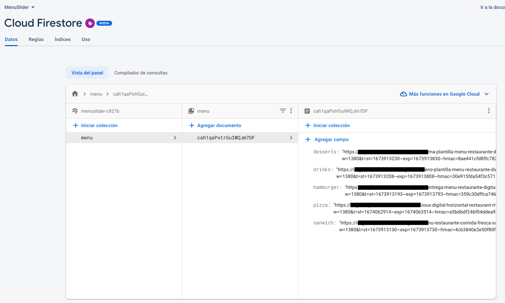

# AndroidTv - MenuSlider

  

This simple project is to integrate JetpackCompose, AndroidTV, Firebase's Firestore, Dagger Hilt and Glide to display a Fast Food style restaurant menu but in a dynamic way, where one or several images can be integrated.

## Firestore configuration (Example)

You can add as many images as you need or you can remove them. 

## Real example (AndroidTv 720dp)

